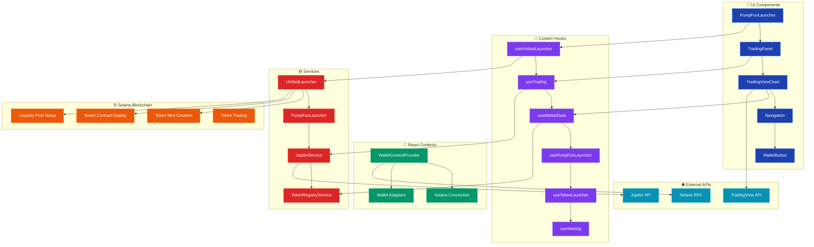
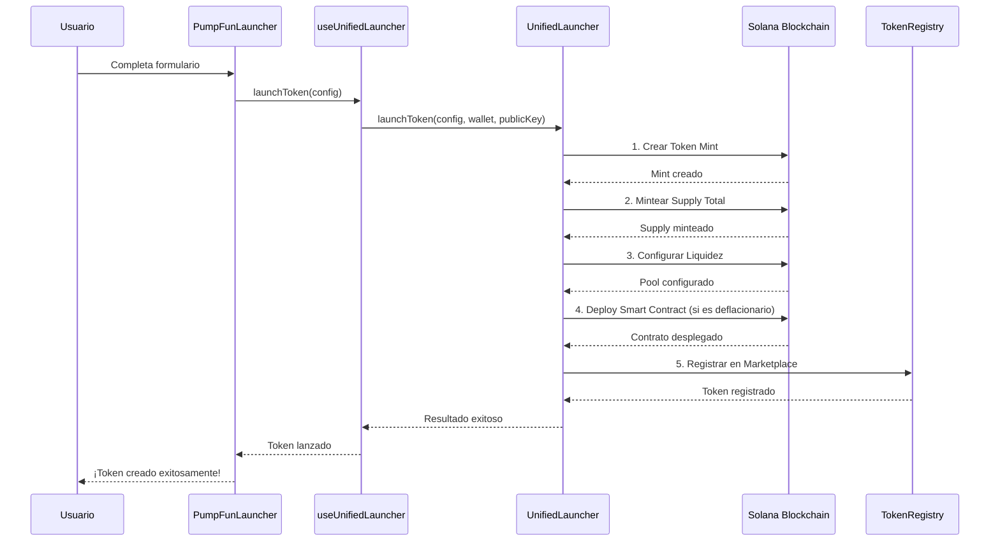
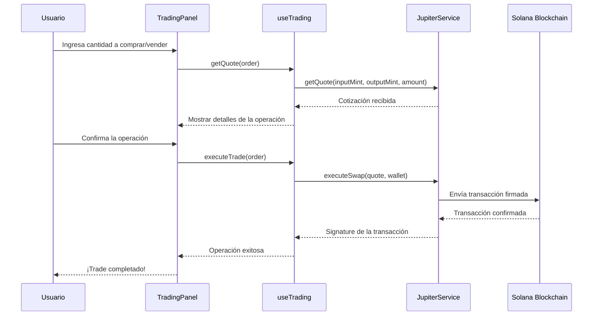

# Flujo del Sistema SolHell Defla

## Diagrama de Arquitectura

## Flujo Detallado del Sistema

### 1. **Capa de Interfaz de Usuario (Components)**
- **PumpFunLauncher**: Modal para lanzar tokens nuevos
- **TradingPanel**: Panel de trading con órdenes de compra/venta
- **TradingViewChart**: Gráficos de precios y volumen
- **Navigation**: Navegación principal de la app
- **WalletButton**: Conectar/desconectar wallet

### 2. **Capa de Contexto (Contexts)**
- **WalletContextProvider**: Provee conexión a Solana y wallets
- **Solana Connection**: Conexión a la red Solana (devnet)
- **Wallet Adapters**: Soporte para Phantom, Solflare, etc.

### 3. **Capa de Hooks (Custom Hooks)**
- **useUnifiedLauncher**: Hook principal para lanzar tokens
- **useTrading**: Maneja operaciones de trading
- **useMarketData**: Obtiene datos del mercado
- **usePumpFunLauncher**: Hook específico para PumpFun
- **useTokenLauncher**: Hook para lanzamiento de tokens
- **useStaking**: Maneja operaciones de staking

### 4. **Capa de Servicios (Services)**
- **UnifiedLauncher**: Servicio principal que combina PumpFun + Smart Contracts
- **PumpFunLauncher**: Servicio específico para lanzamiento estilo PumpFun
- **JupiterService**: Integración con Jupiter para swaps
- **TokenRegistryService**: Registro y gestión de tokens

### 5. **Capa de Blockchain (Solana)**
- **Token Mint Creation**: Creación del token mint
- **Smart Contract Deploy**: Despliegue de contratos inteligentes
- **Liquidity Pool Setup**: Configuración de pools de liquidez
- **Token Trading**: Trading de tokens

### 6. **APIs Externas**
- **Jupiter API**: Para obtener cotizaciones y ejecutar swaps
- **Solana RPC**: Conexión a la red Solana
- **TradingView API**: Para datos de gráficos (opcional)

## Flujo de Lanzamiento de Token

## Flujo de Trading

## Características Principales

### 🚀 **Lanzamiento Unificado**
- Combina PumpFun + Smart Contracts
- Lanzamiento GRATIS (sin liquidez inicial)
- Bonding curve automática
- Soporte para tokens deflacionarios

### 💱 **Trading Avanzado**
- Integración con Jupiter
- Órdenes de mercado y límite
- Control de slippage
- Gráficos en tiempo real

### 📊 **Marketplace**
- Registro automático de tokens
- Datos de mercado en tiempo real
- Sistema de trending y top gainers
- Order book y historial de trades

### 🔒 **Seguridad**
- Validación de configuraciones
- Manejo de errores robusto
- Confirmación de transacciones
- Verificación de lanzamientos
